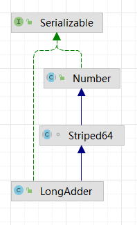

### 笔记

## 1.并发编程线程基础

### 1.1 进程与线程

线程状态：运行 阻塞 就绪

进程是资源分配的基本单位，线程是独立调度的基本单位

cpu资源分配给线程

java中 main函数所在的线程是主线程

一个进程可以有多个线程，多个线程之间共享 堆 和 方法区，每个线程有自己独立的 程序计数器 和 栈

### 1.2 线程创建与运行

多线程的三种方式:

1. 继承Thread类
    * 获取当前线程直接用 this (无需 Thread.currentThread())，可以再子类中添加成员变量通过 setter 或构造函数进行传递
    * java不支持多继承，任务和代码没有分离
    * 没有返回值

2. 实现Runnable方法

    * 只能使用主线程中声明为 final 的变量

    * 没有返回值

3. FutureTask
    * ft.get() 获取返回值

### 1.3 线程通知与等待 (Object)

1. wait() 函数
    * 当一个线程调用一个共享变量的 wait() 方法时，该调用线程会被阻塞挂起，直到：
        * 其他线程调用该共享对象的 notify() 或 notifyAll()
        * 其他线程调用该线程的 interrupt() 方法，该线程抛出 InterruptedException 异常返回

    * 释放已获取的锁

      如果调用 wait() 方法的线程没有事先获取该对象的监视器锁，则调用 wait() 方法时调用线程会抛出 IllegalMonitorStateException 异常，获取监视器锁的方法：

        1. 执行 synchronized 同步代码块时，使用该共享变量作为参数
        2. 调用该共享变量的方法，且该方法使用 synchronized 修饰
   ```java
   // 获取对象监视器锁
   // 1. 
   synchronized(共享变量) {
       // doSomething
   }
   
   // 2. 
   synchronized void method() {
       // doSomething
   }
   
   // 避免虚假唤醒
   synchronized(obj) { // 通过同步块获取 obj 上面的监视器锁
       while (!satisfied) {
           obj.wait();
       }
   }
   ```

2. wait(long timeout)函数

   如果没有在给定时间 timeout 内调用 notify() 或者 notify() 唤醒，会因超时而返回

   wait(0) == wait() 传入负数 -> 抛出 IllegalArgumentException

3. wait(long timeout, int nanos) 函数

   当 nanos>0 时, timeout 递增(每次 while 循环都会导致等待时间增加)

   ```
    synchronized (obj) {
        while (<condition does not hold> and <timeout not exceeded>) {
            long timeoutMillis = ... ; // recompute timeout values
            int nanos = ... ;
            obj.wait(timeoutMillis, nanos);
        }
        ... // Perform action appropriate to condition or timeout
    }
   ```

4. notify() 函数 

   当一个线程调用共享对象的 notify() 方法后，会唤醒一个在该共享变量上调用 wait() 方法后被挂起的线程

   一个共享变量上可能会有多个线程在等待，具体唤醒哪一个是随机的，被唤醒的线程要去和其他线程一起竞争该锁 (只有当前线程获取到共享变量的监视器锁后才能调用改方法，否则会抛出 IllegalMonitorStateException 异常)

5. notifyAll() 函数 

    会唤醒在该共享变量上由于调用 wait() 函数而被挂起的线程

​	

### 1.4 等待线程执行终止的join()方法 (Thread)


主线程会在调用 join 方法后被阻塞，等待线程完成后继续执行

线程A调用线程B的 join 方法后会被阻塞，其他线程调用线程A的 interrupt 方法中断线程A时，线程A会抛出 InterruptedException 异常然后返回

void Thread.join()
threadOne.join() 


### 1.5 线程睡眠sleep() (Thread)


让出执行权，不释放该线程拥有的监视器资源

当一个线程处于睡眠状态时，如果另外的线程中断了它，会在调用 sleep 方法处抛出异常

public static native void sleep(long millis) 如果 millis 传入负数，会抛出 InterruptedException 异常


### 1.6 CPU让出执行权 yield() (Thread)


时间片还有，不想用了，主动进入**就绪**状态 

sleep 是阻塞


### 1.7 线程中断

1. void interrupt() 设置线程的中断标志位true并立刻返回  
   如果线程正在因为wait, join, sleep而被阻塞，则抛出InterruptedException异常
2. boolean isInterrupted() 检测当前线程是否被中断
3. boolean interrupted() 检测当前线程是否被中断，并清除中断标志

### 1.8 线程上下文切换

时机：当前线程的CPU时间片用完处于就绪状态，当前线程被其他线程中断

### 1.9 线程死锁

1. 同时符合四个条件
    1. 互斥(某项资源同一时刻只能被一个线程使用)
    2. 不可抢占(线程主动释放资源前，其他线程不能抢占)
    3. 循环等待(多个线程之间循环等待其他资源)
    4. 请求和保持(已获得资源的线程继续请求其他资源是不释放已获得的)
2. 避免死锁
    1. 破环请求和保持 (一次性获取所有资源)
    2. 破环循环等待 (规定获取资源顺序)

### 1.10 守护线程 用户线程

thread.setDaemon(true)  
所有的用户线程结束后，结束JVM进程

### 1.11 ThreadLocal

创建一个ThreadLocal变量，访问该变量的每个线程都会有一个该变量的本地副本；操作该变量时，操作的是 自己本地内存里的变量，避免线程安全问题。

#### 实现原理

Thread 里面有两个 ThreadLocalMap(threadLocals, inheritableThreadLocals)
threadLocal类型的本地变量存放在具体的线程内存空间中  
每个线程的本地变量不存放在ThreadLocal实例里面，而是存放在调用线程的threadLocals变量里面  
子线程访问父线程的变量

```
ThreadLocal<String> local = new InheritableThreadLocal<>();
```

## 2. 并发编程

### 2.1 多线程并发编程

* 并发：一段时间内多个任务同时执行
* 并行：同一时刻多个任务同时执行
* 线程安全问题：多个线程同时读写一个共享资源且没有任何同步措施时，导致出现脏数据或其他不可预见的问题。
* Java内存模型：所有的变量都存放在主内存中，当线程使用变量时，会把主内存中的变量复制到自己的工作内存，线程读写 变量时操作的是自己工作内存中的变量，处理完后同步回主内存
* 内存可见性问题 (CPU寄存器 -> 缓存 -> 主内存)
* synchronized 监视器锁 (阻塞线程 需要从用户态 切换到 内核态)
    * 获取锁后：清空本地内存变量，全部从主内存中获取
    * 释放锁前：将本地内存的修改同步回主内存
* volatile 使用场景 (提供可见性，不保证原子性)
    * 写入值不依赖当前值
    * 读写变量时没有加锁

### 2.7 java中的原子操作

set get方法都要synchronized，来保证可见性

### 2.9 Unsafe类

Unsafe类提供硬件级别的原子操作，都是native方法  
rt.jar提供，由Bootstrap classloader加载  
main方法由 application classloader加载，因此无法直接使用(用反射)

### 2.10 指令重排序

java内存模型运行编译器和处理器对指令重排序以提高运行性能，并且只会对不存在数据依赖的指令重排序  
单线程下可以保证最终的执行结果与程序顺序执行的结果一致，多线程会存在问题

### 2.11 伪共享

程序的局部性原理  
为了解决主内存和CPU之间运行速度差的问题，会加入一级或多级高速缓存存储器Cache  
存放到cache行中的是内存块而不是单个变量，可能会把多个变量放到一个Cache行中。当多个线程同时修改一个缓存行里的多个变量时 由于同时只能有一个线程操作缓存行，性能会有所降低，这就是伪共享  
@sun.misc.Contended解决伪共享问题

### 2.12 锁

1. 乐观锁和悲观锁：
    1. 乐观锁：认为数据在一般情况下不会发生冲突，所以在访问记录前不会加排它锁，而是在进行数据提交更新时，才会正式对数据冲突与否进行检测
    2. 悲观锁：对数据被外界修改持保守态度，认为数据很容易会被其他线程修改，所以，在数据被处理前先对数据进行加锁，并在整个数据处理过程中，使数据处于锁定状态

2. 公平锁和非公平锁(按照获取锁的抢占机制)
    1. 公平锁：线程获取锁的顺序按照线程请求锁的时间早晚来决定
    2. 非公平锁：未必按顺序
    ```
        ReentrantLock lock = new RentrantLock(true); // 公平锁
        ReentrantLock lock = new RentrantLock(false); // 非公平锁
    ```

3. 独占锁和共享锁(按照锁只能被单个线程持有还是能被多个线程共同持有)
    1. 独占锁：保证任何时候只有一个线程能得到锁
    2. 共享锁：可以同时由多个线程持有
    ```
        ReentrantLock: 独占锁
        ReadWriteLock: 共享锁
    ```

4. 可重入锁(当一个线程获取它自己已经获取的锁时，不会被阻塞)  
   synchronized是可重入的(计数器，记录加锁次数)

5. 自旋锁(当线程获取锁时，如果发现已被其他线程获取，不会马上阻塞自己，在不放弃cpu使用权的情况下，多次尝试)

## 3. ThreadLocalRandom类原理剖析

### 3.1 Random的局限性

`nextInt(bound)`

1. 根据老的种子生成新的种子
2. 根据新的种子计算新的随机值

也就是说当多个线程根据同一个老种子计算新种子时， 第一个线程的新种子被计算出来后， 第二个线程要丢弃自己老的种子，而使用第一个线程的新种子来计算自己的新种子， 依此类推，只有保证了这个，才能保证在多线程下产生的随机s数是随机的。

每个Random 实例里面都有一个原子性的种子变量用来记录当前的种子值，当要生成新的随机数时需要根据当前种子计算新的种子并更新回原子变量。 在多线程下使用单个Random 实例生成随机数时，当多个线程同时计算随机数来计算新的种子时，
多个线程会竞争同一个原子变量的更新操作，由于原子变量的更新是CAS 操作，同时只有一个线程会成功，所以会造成大量线程进行自旋重试， 这会降低并发性能，所以ThreadLocalRandom 应运而生。

`ThreadLocalRandom`中没有存放具体的种子，具体的种子存放在具体的调用线程的`threadLocalRandomSeed`里面  
`ThreadLocalRandom.current()` 负责初始化调用线程里的`threadLocalRandomSeed`变量，静态方法，多个线程返回同一个对象

**ThreadLocalRandom使用ThreadLocal的原理，让每一个线程持有一个本地的种子变量，该种子变量只有在使用随机数时才会被初始化， 多线程下计算新种子时根据自己线程内维护的种子变量进行更新，避免竞争**

## 4. 原子操作类原理剖析(CAS)

### 4.1 原子变量操作类

```
AtomicInteger, AtomicLong, AtomicBoolean

incrementAndGet() -> getAndAddLong(this, valueOffset, 1L) + 1L;
decrementAndGet() -> getAndAddLong(this, valueOffset, -1L) - 1L;
getAndIncrement() -> getAndAddLong(this, valueOffset, 1L);
getAndDecrement() -> getAndAddLong(this, valueOffset, -1L);

valueOffset = unsafe.objectFieldOffset(AtomicLong.class.getDeclaredField("value"));
// value变量在AtomicLong中的偏移量 (value存放具体计数的变量 volatile(保证内存可见性))

```

### 4.2 LongAdder(原子性递增或递减类)

AtomicLong的瓶颈为 多线程竞争同一个原子变量  
LongAddr 内部维护多个Cell，争夺单个变量操作的线程量就会减少  
多个线程争夺同一个Cell原子变量失败了，并不是在当前Cell变量上一直自旋CAS重试，而是尝试在其他Cell变量上进行CAS尝试，
这个改变郑家了当前线程重试CAS成功的可能性。最后在获取LongAdder当前值时，把所有Cell变量的value值累加后加上base返回

Cell 原子性更新数组 2^n 是一个AtomicLong的改进，解决伪共享的问题

使用@Content修饰，放置多个元素共享一个缓存行，提高性能  


Striped64

1. base: long 真实值为(base + Cell[i ... n])
2. cellsBusy: volatile int 实现自旋锁(0, 1) 创建Cell元素，扩容Cell数组或初始化Cell数组时， 用CAS操作保证同时只有一个线程可以进行其中之一操作
3. cells: volatile Cell[]

1. LongAdder的结构是怎样的? 包装一个`volatile long value`
2. 当前线程应该出问Cell数组里面的哪一个Cell元素? 当前线程应该访问cells 数组的哪一个Cell元素是通过getProbe() & m 进行计算的， 其中m 是当前cells 数组元素个数－ 1 , getProbe()
   则用于获取当前线程中变量threadLocalRandomProbe 的值，这个值一开始为0 ， 后面其进行初始化。
3. 如何初始化Cell数组? cellsBusy 是一个标示，为0说明当前cells 数组没有在被初始化或者扩容，也没有在新建Cell元素， 为1则说明cells数组在被初始化或者扩容，或者当前在创建新的Cell
   元素、通过CAS操作来进行0或1状态的切换
4. Cell数组如何扩容? 当前cells的元素个数小于当前机器CPU 个数并且当前多个线程访问了cells中同一个元素 从而导致冲突使其中一个线程CAS 失败时才会进行扩容操作,将容量扩充为之前的2倍
5. 线程访问分配的Cell 元素有冲突后如何处理? 对CAS 失败的线程重新计算当前线程的随机值threadLocalRandomProbe,以减少下次访问cells 元素时的冲突机会
6. 如何保证线程操作被分配的Cell元素的原子性? cas函数通过CAS 操作，保证了当前线程更新时被分配的Cell元素中value值的原子性。 使用@Contented避免伪共享

### 4.3 LongAccumulator

LongAdder是LongAccumulator的一个特例  
LongAdder 只能提高默认的0值  
LongAccumulator 可以提供非0的初始值，指定累加规则

## Java并发包中的List源码剖析(CopyOnWriteArrayList)

线程安全：进行的修改哦操作都是在底层的一个复制数组(快照)上进行的  
有一个array数组存放具体的元素，ReentrantLock(独占锁)保证同时只有一个线程对array进行修改

### 5.2 代码解析

1. 初始化  
   无参构造函数：创建大小为0的Object数组作为array的初始值  
   参数为 E[]: 创造一个list，将传入的数组元素复制进去  
   参数为 Collection 将传入集合的元素复制进去


2. 添加元素 `add(E e)`
    1. 获取独占锁 `ReentrantLock`
    2. 获取存放元素的`array`
    3. 复制array到另一个新创建的数组(新数组的长度为原来的+1 因此是无界的)，添加新元素e到新数组
    4. 使用新数组替换原来的
    5. 释放独占锁

3. 获取指定位置的元素`get(int index)`
    1. 获取array数组
    2. 通过下标访问指定位置的元素

4. 修改指定位置的元素`set(int index, E element)`
    1. 获取独占锁
    2. 获取存放元素的array
    3. 调用get方法获取指定位置的元素：
        * 如果指定位置的元素值和新值不一样，新建一个数组并复制所有的元素
        * 如果相同，为了保证volatile语义，还要重新设置array
    4. 释放独占锁

5. 删除元素`remove(int index)`
    1. 获取独占锁
    2. 获取存放元素的数组array
    3. 获取指定位置的元素
    4. 新建一个数组存放元素
        * 如果要删除的是最后一个元素：复制一次Arrays.copyOf(elements, len-1)
        * 否则：分两次复制
    5. 使用新数组代替原来的
    6. 释放独占锁

6. 弱一致性的迭代器  
   COWIterator 存放数组的快照`snapshot`, 获取到给定的迭代器后，其他线程对该list的修改不可见，操作的是两个不同的数组

## 6.java并发包中的锁原理

1. LockSupport工具类(rt.jar)  
   该工具类用来挂起和唤醒线程，是创建锁和其他同步类的基础  
   LockSupport类与每个使用它的线程都会关联一个许可证，默认情况下调用LockSupport类的方法的线程是不持有许可证的，使用Unsafe类实现

    1. park()  
       如果调用park方法的线程已经拿到了与LockSupport关联的许可证，调用park()方法会马上返回，否则调用线程会被禁止参与线程的调度(阻塞挂起)  
       其他线程调用unpark(thread)方法并将当前线程作为参数时，调用park方法被阻塞的线程会返回  
       如果其他线程调用了阻塞线程的interrupt()方法(设置了中断标志会被虚假唤醒)，阻塞线程也会返回  
       (调用park方法而被阻塞的线程被其他线程中断而返回时不会抛出InterruptedException异常)

    2. unpark(thread)
       如果线程调用unpark方法，如果参数thread线程没有持有thread与LockSupport类关联的许可证，则让thread线程持有  
       如果thread之前因为调用park而被挂起，则调用unpark后，该线程会被唤醒  
       如果thread之前没有调用park，则调用unpark方法后，在调用park，会立刻返回

    3. parkNanos(long nanos)  
       如果调用park方法的线程拿到了与LockSupport关联的许可证，调用改方法后立刻返回  
       如果没有拿到许可证，调用线程会被挂起nanos时间和自动返回

    4. park(Object blocker)
       当前线程没有持有许可证调用park方法被阻塞挂起，这个blocker对象会被记录到线程内部  
       Thread中的 volatile Object parkBlocker 存放park方法传递的blocker(将blocker变量存放到了调用park方法的线程的成员变量里面)

    5. parkNanos(Object blocker, long nanos)
       多了个超时时间
    6. parkUntil(Object blocker, long deadline)
       指定一个时间点


2. AbstractQueuedSynchronizer 抽象同步队列  
   FIFO双向队列，通过节点(Node) head 和tail 记录队首和队尾  
   thread变量用来存放进入AQS队列里的线程； shared用来标记该线程是获取共享资源时被阻塞挂起后放入AQS队列的； exclusive用来标记线程时获取独占资源时被挂起后放入AQS队列的；
   waitStatus记录当前线程等待状态
    * cancelled 线程被取消
    * signal 线程需要被唤醒
    * condition 线程在条件队列里等待
    * propagate 释放共享资源时需要通知其他节点 prev记录当前节点的前驱节点； next记录当前节点的后继节点

   维护一个单一的状态信息：state
    * ReentrantLock 当前线程获取锁的可重入次数
    * ReentrantReadWriteLock 高16位表示读状态(获取读锁的次数)，低16为表示获取到写锁线程的可重入次数
    * Semaphore 当前可以信号个数
    * CountDownLatch 当前计数器的值

   ConditionObject内部类(结合锁实现线程同步)
    * 条件变量(每个条件表里对应一个条件队列(单向链表队列firstWaiter, lastWaiter)，用来存放条件变量的await方法后被阻塞的线程)

   线程同步的关键是对状态值state进行操作。根据state是否属于一个线程，操作方式分为独占式 和 共享式
    * 独占式 (acquire, acquireInterruptibly, release)
    * 共享式 (acquireShared acquireSharedInterruptibly releaseShared)

   使用独占方式获取的资源是与其他线程绑定的(ReentrantLock)  
   共享方式获取的资源是与具体线程不相关的(Semaphore)


3. 独占锁ReentrantLock原理

   ReentrantLock可重入独占锁，默认为非公平锁，state为线程获取该锁的可重入次数

    1. 获取锁 lock()  
       非公平锁
        * 如果锁当前没有被其他线程占有并当前线程没有获取过该锁，则当前线程会获取到该锁，并设置当前锁的拥有线程为当前线程(setExclusiveOwnerThread)
          设置AQS的状态值为1，直接返回
        * 如果当前线程已经获取了该锁，只是简单的将AQS的状态值+1
        * 如果该锁已被其他线程持有，该线程会被放入AQS队列后阻塞挂起  
          公平锁
        * 会判断是否有前驱节点

    2. lockInterruptibly()  
       相应中断： 当前线程在调用该方法时，如果其他线程调用了当前线程的interrupt()方法，当前线程会抛出InterruptedException，返回

    3. tryLock() 非公平  
       尝试获取锁，如果当前锁没有被其他线程持有，则当前线程获取该锁并返回true，该方法不会引起当前线程阻塞

    4. tryLock(long timeout, TimeUnit unit)  
       尝试获取锁，设置了超时时间，规定时间内没有获取到锁，返回false

    5. unlock()  
       释放锁
        * 如果当前线程持有锁，调用该方法会让该线程对该线程持有的AQS状态值-1，如果-1之后状态中为0，当前线程会释放该锁(setExclusiveOwnerThread)， 否则仅仅-1而已
        * 如果当前线程没有持有该锁，抛出IllegalMonitorStateException

4. ReentrantReadWriteLock原理 读写分离，允许多个线程可以同时获取读锁

    1. 类图  
       读写锁内部维护了 ReadLock 和 WriteLock 类，使用state的低16位 和 高16位 依次表示 读状态 和 写状态(最大可重入次数为65535)  
       firstReader 记录第一个获取到读锁的线程  
       firstReaderHoldCount 记录第一个获取到读锁的线程获取读锁的可重入次数  
       cachedHoldCounter 记录最后一个获取读锁的线程获取读锁的可重入次数  
       readHolds (ThreadLocal)存放除去第一个线程外的其他线程获取读锁的可重入次数

    2. 写锁(WriteLock)的获取与释放
        1. lock()  
           独占锁+可重入锁，某个时刻只能有一个线程获取该锁  
           判断是否有其他线程获取读锁
        2. lockInterruptibly() 会对中断进行相应
        3. tryLock()  
           尝试获取写锁，非公平策略
        4. tryLock(long timeout, TimeUnit unit)  
           如果尝试获取写锁失败，将当前线程挂起指定时间，待超时时间到后当前线程被激活，如果还没有获取到写锁返回false  
           该方法会相应中断(如果其他线程调用该线程的interrupt()，则抛出异常)
        5. unLock()  
           尝试释放锁，判断低16位(将状态值-1)

    3. 读锁(ReadLock)的获取与释放
        1. lock()

## 7. Java并发包中队列原理

阻塞队列 锁  
非阻塞队列 CAS

1. ConcurrentLinkedQueue  
   线程安全的无界非阻塞队列，CAS  
   单项链表实现 两个 volatile Node 存放队列首位节点  
   使用Unsafe工具类提供的CAS算法保证出入队时操作链表的原子性

    1. offer()  
       在队列末尾添加一个元素，如果传递的参数为null，抛出空指针异常，使用CAS无阻塞算法，不会挂起调用的线程

2. LinkedBlockingQueue  
   有界阻塞 独占锁实现  
   单向链表  
   Node<E> head last 存放首尾节点  
   AtomicInteger count 记录队列元素个数  
   ReentrantLock takeLock putLock 控制出队入队的原子性  
   Condition notEmpty notFull 条件变量，内部存在一个条件队列存放入队出队被阻塞的线程

    1. offer(E e)  
       向队列尾部插入一个元素，成功则返回true，如果队列已满丢弃其当前元素返回false
        1. 如果e为null抛出空指针异常 非阻塞的
        2. 如果当前队列满，丢弃当前元素，返回false
        3. 构造新节点，获取putLock独占锁
        4. 如果队列不满则入队，并递增元素计数
        5. 唤醒notFull队列里因为调用了notFull的await操作而被阻塞的一个线程(put或offer时队列满的时候)， 现在队列有空闲，所有可以提前唤醒一个入队线程
        6. 在finally里释放putLock锁
        7. 如果目前队列中至少有一个元素则signalNotEmpty，激活notEmpty队列中因为调用notEmpty的await方法而被阻塞的线程(调用take方法并且队列为空)
           (获取条件变量的方法前要获取对应的锁)
           ```
                putLock.lock() -> notFull.signal() -> putLock.unlock()
                takeLock.lock() -> notEmpty.signal() -> takeLock.unlock()
           ```
           offer方法通过使用putLock锁保证在队列尾部新增元素操作的原子性

    2. put(E e)
       向队列尾部插入元素，如果队列有空闲直接插入返回，如果队列已满则阻塞当前线程，直至成功插入  
       如果在队列阻塞期间被其他线程设置了中断标志，则抛出异常返回(e不能为null)

    3. poll()
       从队列头获取并移除一个元素，如果队列为空返回null，不阻塞
        1. 如果队列为空，返回null
        2. 获取takeLock独占锁(其他线程在调用poll或take时会被阻塞挂起)
        3. 如果队列不为空执行出队操作，递减计数器
        4. 如果当前队列移除队首元素后不为空，则激活因为调用take方法而被阻塞到notEmpty队列里的一个线程
        5. 在finally中释放takeLock锁
        6. 如果移除元素前队列是满的，移除一个之后至少有一个空闲位置，调用signalNotFull激活因为调用put方法而被 阻塞到notFull的条件队列里的线程

    4. take()  
       获取当前队列的头部元素并移除 如果队列为空则阻塞纸质队列不为空返回返回，如果在阻塞时其他线程设置了中断，该线程抛出异常返回

    5. peek()
       获取队列的头部元素但不移除它，队列为空返回null 不阻塞

    6. remove()
       删除队列里的指定元素 有则删除返回true，否则返回false  
       需要同时获取takeLock和putLock(需要遍历队列查找指定元素，会在阻塞其他入队出队的线程)，获取锁和释放锁的顺序时相反的

    7. size()  
       获取当前元素个数

3. ArrayBlockingQueue  
   采用有界数组实现阻塞队列，构造函数必须指定队列容量 默认非公平锁  
   Object[] item 存放元素  
   putIndex 入队元素下标  
   takeIndex 出队元素下标   
   count 统计队列元素数量  
   ReentrantLock lock 保证出队入队的原子性，同一时刻只能有一个线程进行入队或出队操作  
   Condition notEmpty notFull 进行出队入队同步

    1. offer(E e)
    2. put(E e)
    3. poll()
    4. take()
    5. peek()
    6. size() 精确值 (获取锁后访问的变量都是从主内存获取的，这保证了变量的内存可见性)

4. PriorityBlockingQueue   
   带优先级的无界阻塞队列，每次出队返回优先级最高或最低的元素 平衡二叉树堆实现  
   遍历元素不保证有序，默认使用对象的compareTo进行比较  
   Object[] queue 数组存放元素  
   size 存放元素个数  
   volatile int allocationSpinLock 自旋锁，使用CAS操作保证同一时刻只能有一个线程可以扩容队列  
   notEmpty 实现take方法阻塞模式(没有notFull，因为put操作是非阻塞的不会被await，无界队列)  
   默认容量11 默认比较器null(compareTo)

    1. offer(E e)
       向队列中插入一个元素，无界队列所以一直返回true  
       如果当前元素个数 >= 队列容量 扩容(会释放锁，使用CAS控制只有一个线程可以进行扩容)  
       其他线程会yield让出CPU，让扩容线程成功后重新获取锁

    2. poll()
       获取队列内堆的根节点元素，如果队列为空返回null


5. DelayQueue  
   无界阻塞延迟队列，每个元素都有过期时间，获取元素时，只有过期元素才会出队，队头元素时最快要过期的元素  
   使用PriorityQueue存放数据，使用ReentrantLock实现线程同步  
   实现Delay接口(获取当前元素还剩下多少时间就过期)  
   Condition available 实现线程同步  
   Thread leader 一个线程调用take方法会变成leader线程，调用条件变量available.awaitNanos(delay)等待delay时间， 其他线程调用available.await()
   无限等待。leader线程延迟时间过期以后，会退出take方法，调用available.signal()
   唤醒一个follower线程，被唤醒的线程成为新的leader线程(leader线程用来说明是否有其他线程在执行take)  
   减少线程等待

    1. offer(E e)
       插入元素到队列 由于是无界队列，一直返回true(插入的元素要实现Delay接口)  
       插入之后还要判断新插入的是不是最先过期的

    2. take()
       获取并移除队列里过期的元素，没有则等待

    3. poll()
       获取并移除队头过期元素，没有过期元素返回null

## 线程池原理

1. 作用：
    1. 执行大量异步任务时提供较好的性能(线程可复用，不需每次都创建和销毁线程)
    2. 提供一种资源限制和管理的手段(限制线程个数)

2. 类图 和 一些参数
    1. ThreadPoolExecutor AtomicInteger ctl(高3位表示线程池状态，低29位表示线程池线程个数)
    2. corePoolSize
    3. maximumPoolSize
    4. keepAliveTime 0表示线程个数比核心线程个数多并空闲时立刻回收
    5. timeUnit
    6. workQueue 保持等待执行线程的阻塞队列
    7. ThreadFactory 创建线程的工程
    8. rejectedExecutionHandler 饱和策略

    9. works 继承AQS Runnable 具体承载任务的对象 10.Work firstTask 记录该工作线程执行的第一个任务
    11. Work thread 具体执行任务的线程

    12. ThreadFactory newThread() 对线程的一个修饰
    13. ThreadFactory poolNumber(static AtomicInteger) 统计线程工程的个数
    14. ThreadFactory threadNumber 记录每个线程工程创建了多少线程

3. 源码分析

    1. execute(Runnable) 提交任务到线程池并进行执行
        1. 如果runnable为null，抛出NullPointerException异常
        2. 获取线程池当前状态 + 线程个数 (ctl)
        3. 判断当前线程池的线程个数是否小于corePoolSize，小于的话开启新线程
        4. 如果线程处于RUNNABLE状态，添加任务到阻塞队列，
            1. 二次检测线程池状态 + 线程个数 (ctl)
            2. 如果线程池状态不是RUNNABLE，则从队列中删除任务，执行拒绝策略
            3. 如果线程池为空，添加一个线程
        5. 如果队列满，新增线程，新增失败就执行拒绝策略

       addWork(Runnable, core) // 新增线程
        1. 双重循环，通过CAS增加线程数
            1. 检查队列是否只在必要时为空
            2. 使用CAS增加线程数 如果线程个数超过限制返回false； 用CAS增加线程个数，只有一个线程成功； 如果CAS失败，查看线程池状态是否变化了，如果变化了跳到外层从新获取线程池状态，构造内循环重新CAS创建线程
        2. 把并发安全的任务添加到workers里，并启动任务执行
            1. 已经CAS创建线程成功了，使用独占锁ReentrantLock将新的Work添加到workers里面 重新检查线程池状态；如果线程池关闭 -> 释放锁，新增任务失败；
               否则添加工作线程到线程工作集workers，释放锁，最后启动

    2. 工作线程Worker的执行  
       用户线程提交任务到线程池后，由Worker来执行。
        1. 设置worker的状态为-1(避免当前Worker在调用runWorker方法前被中断)
        2.
        3. 创建一个线程  
           shutdown只会终端当前被阻塞挂起的线程

    3. shutdown 调用shutdown()之后，线程池就不再接收新任务，当工作队列里的任务还是要执行    
       该方法会立刻返回，不对等到队列的任务完成后再返回。
        1. 权限检查(查看调用shutdown方法的线程是否由中断工作线程的权限(SecurityException, NullPointerException))
        2. 设置当前线程池的状态为shutdown，如果已经是shutdown直接返回
        3. 设置中断标志(设置所有空闲线程的中中断标志)

    4. shutdownNow 调用该方法后，不会接收新任务，并丢弃工作队列里的任务，正在执行的任务被中断  
       该方法立刻返回，不等待激活的任务执行完成，返回值为队列里被丢弃的任务列表
        1. 权限检查
        2. 设置线程池状态为stop
        3. 中断所有线程(空闲 + 正在执行的)
        4. 将队列任务移动到tasks(List<Runnable>)中，返回回去

    5. awaitTermination 线程调用该方法后，当前线程会被阻塞，直到线程池状态变为terminated才返回，或等待时间超时才返回
        1. 获取独占锁
        2. 判断当前线程池是否为terminated状态，是的话直接返回
        3. 否则说明当前线程池里面还有线程在执行，判断设置的超时时间nanos是否小于0，小于0说明不需等待直接返回false
        4. 如果nanos大于0，调用条件变量的termination.awaitNanos()方法等待nanos时间，期望这段时间内线程池状态变为terminated
        5. 等待时间超时后，重新检查当前线程池状态是否为terminated，是的话直接返回，否则绩效阻塞挂起自己

## 10. 同步器原理

1. CountDownLatch 使用场景：在主线程中开启多个线程执行任务，并且主线程要等待所有子线程执行完毕后再进行汇总  
   主线程调用await()方法后会被阻塞，子线程执行完毕后调用countDown()让计数器-1，所有子线程执行完毕后计数器为0，然后主线程的await()方法返回  
   一次性的

   CountDownLatch join 区别:
    1. 调用子线程的join()方法(threadOne.join())后，主线程会一直阻塞等待子线程运行完毕， CountDownLatch允许子线程运行完毕 或 运行过程中进行计数器递减，让主线程返回而不一定等到子线程结束
    2. 使用线程池管理线程后，直接添加runnable到线程池，就没有办法调用join方法了；latch更灵活

   原理 将计数器的值赋给AQS的state状态变量
    1. await()
       调用该方法后，当前线程会被阻塞，直到：
        1. 所有线程都调用了countDown方法让计数器为0
        2. 其他线程调用了interrupt()中断当前线程，当前线程抛出InterruptedException异常，然后返回  
           线程获取资源时可以被中断，获取的资源是共享资源
            1. 首先判断当前线程是否已被中断，是则抛出异常，否则查看当前状态中是否为0
            2. 当前状态值为0 await方法直接返回，否则让当前线程阻塞

    2. await(timeout, unit)
       调用该方法后，当前线程会被阻塞，(放入AQS阻塞队列中等待计数器的值变为0)，直到：
        1. 所有线程都调用countDown方法让计数器为0
        2. 设置的timeout时间到了，因超时返回false
        3. 其他线程调用的当前线程的interrupt方法，中断当前线程。。。

    3. countDown()
       调用该方法后，计数器-1，如果计数器的值为0，唤醒所有因调用await方法而被阻塞的线程，否则什么都不做

    4. getCount()
       获取当前计数器的值

2. CycleBarrier  
   让一组线程达到同一个状态后同时执行，可重用  
   new CycleBarrier(int parties, Runnable barrierAction) // 计数器初始值 计数器的值为0后需要执行的任务
   如果计数器的值为N，随后调用await方法的N-1个线程都会因到达屏障点而被阻塞  
   第N个线程调用await方法后，计数器值为0，第N个线程发出通知唤醒前面的N-1个线程  
   全部线程都到达屏障点后才能一起继续向下执行

   基于独占锁AQS实现 parties count 记录线程个数

    1. await() await(timeout, unit)
       调用该方法时，当前线程会被阻塞，直到：
        1. parties个线程都调用了await方法，所有的线程都到了屏障点
        2. 其他线程调用了当前线程的interrupt()方法中断当前线程
        3. 与当前屏障点关联的Generation对象的broken标志被设置为true，抛出BrokenBarrierException异常

    2. dowait(timed, nanos)


3. Semaphore 内部计数器递增 默认为非公平策略
   ```
        new Semaphore(2, true); // 公平策略 
   ```

    1. acquire()  acquire(permits)  
       如果当前信号量>0，直接返回，否则将当前线程放入AQS的阻塞队列中(当其他线程调用了当前线程的interrupt()方法后，当前线程抛异常返回)  
       可以响应中断  
       for(;;) 获取当前信号量的值 计算当前剩余值  
       如果当前剩余值<0(直接返回负数) 或 CAS设置成功(返回剩余值)  
       公平锁：会先判断当前线程节点的前去节点是否也在等待获取该资源，是的话自己放弃获取的权限，放入AQS阻塞队列，否则去获取

       可以获取permits个信号量

    2. acquireUniterruptibly() acquireUniterruptibly(permits)  
       该方法不响应中断(其他线程调用了当前线程的interrupt()方法后，当前线程不会抛出异常)

    3. release() release(permits)  
       将当前信号量的值+1，如果有线程因为调用acquire方法而被阻塞放入AQS阻塞队列，会根据公平策略选择一个信号量个数能被满足的 线程进行激活，激活的线程会尝试获取刚增加的信号量  
       
       


